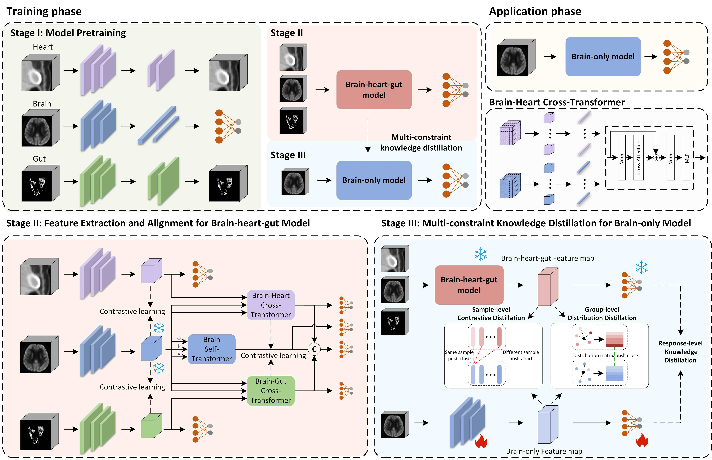

# Framework
Welcome! This is the official implementation of our paper "**Brain-Heart-Gut Guided Multi-Constraint Knowledge Distillation for Early Alzheimer’s Disease Diagnosis**"

## 1. Introduction
In this work, we propose the first framework to integrate brain, heart, and gut based on whole-body PET imaging and leverage these multi-organ interactions to guide brain-only model for early AD diagnosis in clinical applications.

Our proposed framework consists of three main stages:
- **Stage I**: Model pretraining
- **Stage II**: Feature extraction and alignment for brain-heart-gut model
- **Stage III**: Multi-constraint knowledge distillation for brain-only model



## 2. Model Pretraining
- For pretraining our brain model, we develop a **classification** network.
- For pretraining heart and gut models, we conduct **self-supervised reconstruction** network.

Codes of model pretraining are in folder `./stageI_model_pretraining`.
- Pretrain the brain model by simply running the following command: 
```
python resNet_brain.py \
    --aug "$aug" \
    --checkpoints_dir "$checkpoints_dir" \
    --epochs "$epochs" \
    --feats_path "$feats_path" \
    --fold_path "$fold_path" \
    --batch_size "$batch_size" \
    --num_classes "$num_classes" \
    --fold_index "$fold_index" \
    --pretrain_path "$pretrain_path" \
    --model_depth "$model_depth" \
    --resnet_shortcut "$resnet_shortcut" \
    --input_D "$input_D" \
    --input_H "$input_H" \
    --input_W "$input_W"
```

<!-- You can pretrain and test the model of heart/gut in the same way. -->
- Pretrain the heart/gut model by simply running the following command: 
```
python resNet_recon.py \
    --num_workers "$num_workers" \
    --aug "$aug" \
    --checkpoints_dir "$checkpoints_dir" \
    --epochs "$epochs" \
    --feats_path "$feats_path" \
    --fold_path "$fold_path" \
    --batch_size "$batch_size" \
    --fold_index "$fold_index" \
    --pretrain_path_gut "$pretrain_path" \
    --model_depth "$model_depth" \
    --resnet_shortcut "$resnet_shortcut" \
    --input_D "$input_D" \
    --input_H "$input_H" \
    --input_W "$input_W"
```

## 3. Feature extraction and alignment for brain-heart-gut model
The primary goal of Stage II is to achieve improved diagnostic performance compared to the single-modal one through feature alignment and integration of brain, heart, and gut. 
Codes are in folder `./stageII_brain_heart_gut_model`.
- Train the brain-heart-gut model by simply running the following command: 
```
python train.py \
    --checkpoints_dir "$checkpoints_dir" \
    --epochs "$epochs" \
    --num_workers "$num_workers" \
    --feats_path "$feats_path" \
    --fold_path "$fold_path" \
    --batch_size "$batch_size" \
    --num_classes "$num_classes" \
    --fold_index "$fold_index" \
    --pretrain_path_brain "$pretrain_path_brain" \
    --pretrain_path_heart "$pretrain_path_heart" \
    --pretrain_path_gut "$pretrain_path_gut" \
    --model_depth "$model_depth" \
    --resnet_shortcut "$resnet_shortcut"
```

## 4. Feature extraction and alignment for brain-heart-gut model
In this stage, the objective is to enhance the diagnostic performance of the brain-only model under the guidance of brain-heart-gut features.
Codes are in folder `./stageIII_brain_only_model`.
- Train the brain-only model by simply running the following command: 
```
python train.py \
    --checkpoints_dir "$checkpoints_dir" \
    --epochs "$epochs" \
    --num_workers "$num_workers" \
    --feats_path "$feats_path" \
    --fold_path "$fold_path" \
    --batch_size "$batch_size" \
    --num_classes "$num_classes" \
    --fold_index "$fold_index" \
    --pretrain_path_brain "$pretrain_path_brain" \
    --pretrain_path_heart "$pretrain_path_heart" \
    --pretrain_path_gut "$pretrain_path_gut" \
    --pretrain_path_allone "$pretrain_path_allone" \
    --model_depth "$model_depth" \
    --resnet_shortcut "$resnet_shortcut"
```

- Test the brain-only model:
  Use ``model.load_state_dict(pretrain_allone, strict=False)``  

## Acknowledgements
The authors have no conflict of interest to declare.


## Citation
Please cite our paper if the code should be useful for you.

